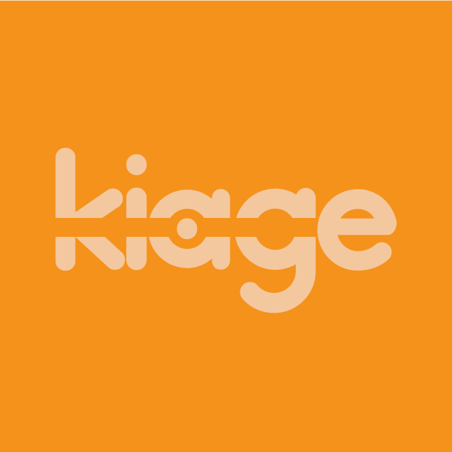

|    M    |            | X   |
| ------------- |:-------------:| -----:|
|       |       |    |
| U |   S    |  A  |

<!--
**teamkiage/teamkiage** is a ✨ _special_ ✨ repository because its `README.md` (this file) appears on your GitHub profile.

Here are some ideas to get you started:

- 🔭 I’m currently working on ...
- 🌱 I’m currently learning ...
- 👯 I’m looking to collaborate on ...
- 🤔 I’m looking for help with ...
- 💬 Ask me about ...
- 📫 How to reach me: ...
- 😄 Pronouns: ...
- ⚡ Fun fact: ...
```diff
- text in red
+ text in green
! Want to hear a coll idea for a game...?
# text in gray
@@ text in purple (and bold)@@
```

-->


```diff
! Games that make you smile ...
+ From smiling people ...
- That know no better ...
```
